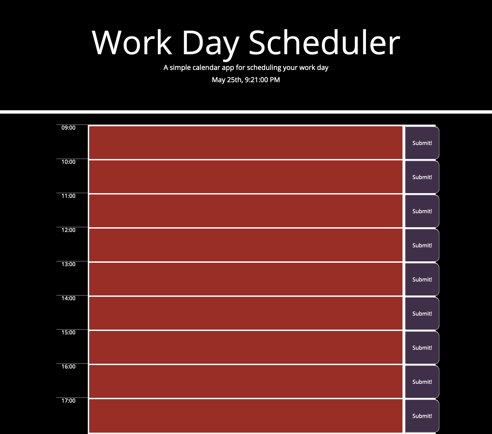

# 05 Third-Party APIs: Work Day Scheduler

## Your Task

I created a simple calendar application that allows a user to save events for each hour of the day by modifying starter code. This app will run in the browser and feature dynamically updated HTML and CSS powered by jQuery. According to the user story.

## Acceptance Criteria
According to the acceptance criteria this is what the user experiences

```md
GIVEN I am using a daily planner to create a schedule
WHEN I open the planner
THEN the current day is displayed at the top of the calendar
WHEN I scroll down
THEN I am presented with timeblocks for standard business hours
WHEN I view the timeblocks for that day
THEN each timeblock is color coded to indicate whether it is in the past, present, or future
WHEN I click into a timeblock
THEN I can enter an event
WHEN I click the save button for that timeblock
THEN the text for that event is saved in local storage
WHEN I refresh the page
THEN the saved events persist
```

## Screenshots


## Links
[GitHub Repo Link](https://github.com/ryanpaynt/day-planner)
[Website Link](https://ryanpaynt.github.io/day-planner/)
